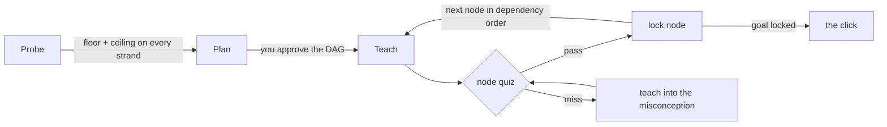

<p align="center">
  
</p>

<h1 align="center">Derive</h1>

<p align="center">
  <strong>Learn anything from first principles.</strong><br/>
  An AI tutor that finds the edge of what you know, draws the dependency map from unconditional truths to your goal,<br/>
  then teaches one node at a time and refuses to move on until each one locks.
</p>

<p align="center">
  <a href="#quick-start">Quick start</a> ·
  <a href="#how-a-lesson-works">How a lesson works</a> ·
  <a href="#why-this-works">Why this works</a> ·
  <a href="#architecture">Architecture</a>
</p>

---

Most "AI tutors" are a chat box with a system prompt. They explain things well and you forget them in a week, because explanation is not the bottleneck. **Connection is.** A fact you can derive from things you already believe is a fact you keep. A fact you were merely told is a fact you lose.

Derive is built around that single idea. Every lesson is a **dependency graph**: a few unconditional truths at the roots, derived steps hanging off them, your goal at the top. The tutor cannot teach a node until its dependencies are locked, and cannot lock a node until you have passed a fresh question on it. You watch the graph light up as your understanding is actually built.

<p align="center">
  
</p>

## What makes it different

- **Probe before teach.** The first minutes are diagnostic. The tutor binary-searches the edge of your knowledge with graded questions until it has both a floor and a ceiling on every strand the lesson rests on. All-correct means the questions were too easy; it escalates.
- **A plan you approve.** Before any teaching, you get the dependency map. Wrong roots or wrong scope are cheap to fix here and expensive mid-lesson. Send it back with one line of feedback and it is redrawn.
- **Honest grading.** Quizzes are a real tool, not a chat convention. The app grades your answer itself and reveals the explanation only afterwards. The model never sees your pick before the card is graded, and never grades it.
- **Motivated, not decreed.** Every step answers "how could I have discovered this myself?" in the 3Blue1Brown tradition. Socratic when you can plausibly reason your way there, expository when you cannot.
- **Verified facts.** The tutor is instructed to web-search anything it is even slightly unsure of before teaching it, and to say so if a check changes what it was about to say.
- **Spaced repetition on nodes, not flashcards.** Locked nodes come back for review on an expanding schedule with a *new* question each time. Miss it and the node is marked shaky and re-derived from its dependencies.
- **Renders properly.** LaTeX via KaTeX, diagrams via Mermaid, streaming markdown. Export any lesson as an Obsidian-ready note with callouts, or write it straight into your vault.
- **Runs on your Claude subscription.** Built on the Claude Agent SDK, so it uses your existing Claude Code login. No API key, no per-token bill, everything stays on your machine in a SQLite file.

## Quick start

Requirements: Node 22+, [pnpm](https://pnpm.io), and a logged-in [Claude Code](https://claude.com/claude-code) install (`claude` on your PATH, or `ANTHROPIC_API_KEY` set).

```bash
git clone https://github.com/jicanta/derive
cd derive
pnpm install
pnpm dev
```

Open http://localhost:5173 and type what you want to understand.

For a single-process production build:

```bash
pnpm build
pnpm start          # serves the UI and API on http://localhost:4310
```

Configuration is optional and lives in environment variables; see [`.env.example`](.env.example). The useful ones:

| Variable | Default | What it does |
|---|---|---|
| `DERIVE_MODEL` | your Claude Code default | Model override, e.g. `claude-opus-5` |
| `DERIVE_EFFORT` | `high` | Reasoning effort: `low` to `max` |
| `DERIVE_VAULT_DIR` | unset | Obsidian folder; enables "To vault" export |
| `DERIVE_DATA_DIR` | `~/.derive` | Where the SQLite database lives |

## How a lesson works



1. **Probe.** The tutor asks what you actually want (an open question) and then quizzes you, adapting each question to the last answer, until it can say concretely what you have and where it ends.
2. **Plan.** It writes a short paragraph on the approach and submits the dependency map. You approve it or send it back.
3. **Teach.** For every node: motivate it, establish it (from its dependencies), connect it explicitly, then quiz-check it. The graph on the right shows the node you are on, what is locked, and what is shaky.
4. **Review.** Locked nodes reappear on the home screen when due. A review session asks one fresh question per node.

## Why this works

Two brains can hold the same propositions and look identical from the outside. One holds a pile of disconnected facts. The other holds a few core truths from which those facts are derivable. Only the second one *understands*, and only the second one retains.

The brain will not fully commit to a fact it is not sure is safe to lock in. If something more fundamental might later contradict it, committing is risky, so it hedges and the fact never lands. Two moves remove that risk:

- **Unconditional truths first.** Facts with no caveats commit instantly and give solid ground to build on.
- **Make it feel discovered, not decreed.** A fact with a visible reason it *had* to be this way stops feeling arbitrary, and arbitrary-feeling facts are the ones that rot.

The teaching method comes from [amosblomqvist/learn](https://github.com/amosblomqvist/learn) and the talk [How I Use AI to Learn Things](https://www.youtube.com/watch?v=kzcI5F4tGiU). Derive turns that terminal workflow into a product: real quiz cards, a live graph, persistence, and review.

## Architecture

```
derive/
├── server/   Node 22 + Hono + node:sqlite + Claude Agent SDK
└── web/      Vite + React 19 + Tailwind 4 + React Flow + KaTeX + Mermaid
```

- **The tutor is an agent with five custom tools**, exposed to Claude through an in-process MCP server: `quiz`, `ask`, `set_plan`, `node_status`, `set_phase`. Plus `WebSearch` and `WebFetch` for verification. Nothing else: no filesystem, no shell.
- **Tools block on you.** When the model calls `quiz`, the server emits a card to the browser and the tool call *waits* until you answer. The server grades the answer, records it, and only then returns the result to the model. The same pattern drives `ask` and plan approval.
- **Event-sourced lessons.** Every turn is a stream of typed events (`assistant`, `quiz`, `quiz_result`, `plan`, `node_status`, ...) appended to SQLite and fanned out over Server-Sent Events. The UI is a reducer over that stream, so reloads, reconnects and the Obsidian export all replay the same log.
- **Conversation continuity** uses Agent SDK session resume: one SDK session per lesson, resumed on every turn.
- **Spaced repetition** is a small expanding-interval schedule on `nodes.review_at`, bumped each time a node is locked from a fresh question.

## Roadmap

- Voice mode for Socratic back-and-forth
- Cross-lesson graph: nodes shared between topics, so a truth locked once is reused everywhere
- Import a PDF or a repo as the source material for a lesson
- Multi-learner profiles

## License

MIT
