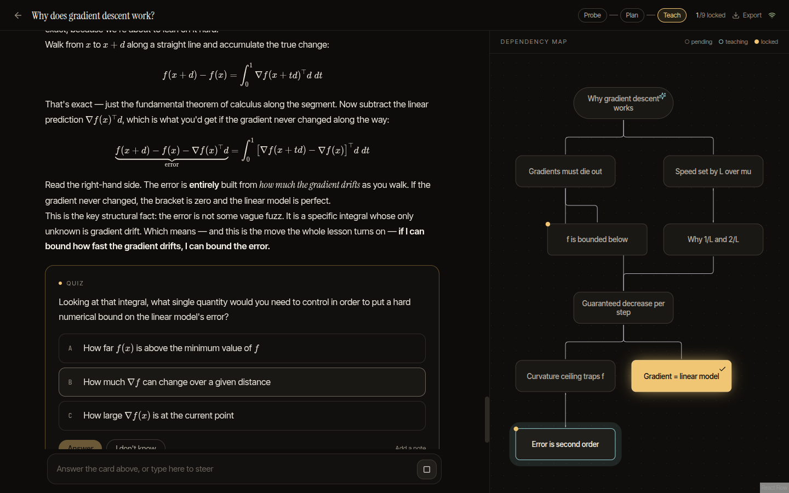
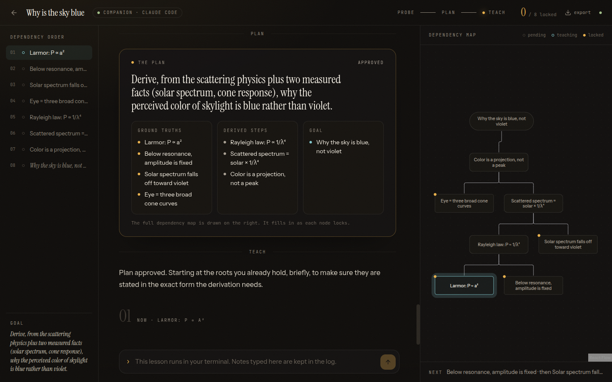
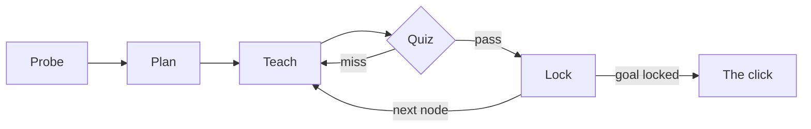

<p align="center">
  
</p>

<h1 align="center">Derive</h1>

<p align="center">
  <strong>Learn anything from first principles.</strong><br/>
  An AI tutor that finds the edge of what you know, draws the dependency map from unconditional truths to your goal,<br/>
  then teaches one node at a time and refuses to move on until each one locks.
</p>

<p align="center">
  <a href="#quick-start">Quick start</a> ·
  <a href="#inside-claude-code">Inside Claude Code</a> ·
  <a href="#how-a-lesson-works">How a lesson works</a> ·
  <a href="#what-makes-it-smart">What makes it smart</a> ·
  <a href="#architecture">Architecture</a>
</p>

---

Most "AI tutors" are a chat box with a system prompt. They explain things well and you forget them in a week, because explanation is not the bottleneck. **Connection is.** A fact you can derive from things you already believe is a fact you keep. A fact you were merely told is a fact you lose.

Derive is built around that one idea. Every lesson is a **dependency graph**: a few unconditional truths at the roots, derived steps hanging off them, your goal at the top. The tutor cannot teach a node until its dependencies are locked, and cannot lock a node until you have passed a fresh question on it. You watch the graph light up as your understanding is actually built.

<p align="center">
  
</p>

It runs two ways, and they share one record:

- **The app.** A local web app with its own tutor, built on the Claude Agent SDK. Type a topic, get taught.
- **Inside Claude Code.** A plugin that adds `/derive:learn` and the teaching method to your terminal. Claude Code teaches; the browser renders the quizzes, the plan and the graph live, the way the original [learn](https://github.com/amosblomqvist/learn) tool mirrored a pi session into Obsidian.

Both run on your Claude subscription. No API key, no per-token bill, everything in a SQLite file on your machine.

## Quick start

Requirements: Node 22+, [pnpm](https://pnpm.io), and a logged-in [Claude Code](https://claude.com/claude-code).

```bash
git clone https://github.com/jicanta/derive
cd derive
pnpm install
pnpm dev            # web on http://localhost:5173, API on :4310
```

Production build, one process:

```bash
pnpm build && pnpm start     # http://localhost:4310
```

Want to see the Atlas, the review queue and the learner memory before you have earned them? Seed a small history into a scratch data directory:

```bash
DERIVE_DATA_DIR=~/derive-demo pnpm demo:seed
DERIVE_DATA_DIR=~/derive-demo pnpm start
```

Optional configuration lives in environment variables; see [`.env.example`](.env.example).

| Variable | Default | What it does |
|---|---|---|
| `DERIVE_MODEL` | your Claude Code default | Model override, e.g. `claude-opus-5` |
| `DERIVE_EFFORT` | `high` | Reasoning effort, `low` to `max` |
| `DERIVE_VAULT_DIR` | unset | Obsidian folder; enables one-click export into your vault |
| `DERIVE_DATA_DIR` | `~/.derive` | Where the SQLite database lives |

## Inside Claude Code

The `plugin/` directory is a Claude Code plugin. It ships:

- **`/derive:learn <topic>`** and **`/derive:review`** commands
- the **`teach` skill**: the full method (below), written for Claude Code
- an **MCP server** exposing the tutor's tools: `quiz`, `ask`, `set_plan`, `node_status`, `explain_back`, `remember`, `learner_profile`
- **hooks** that mirror every terminal turn into the lesson log, so the browser companion shows the prose, the cards and the graph as one record

```bash
pnpm build                      # builds the MCP server the plugin points at
pnpm start                      # keep the Derive server running
claude --plugin-dir ./plugin    # in any project
> /derive:learn why does gradient descent work
```

<p align="center">
  
</p>

Claude Code runs the lesson in your terminal. When it asks a graded question, the tool call blocks, the card appears in the browser, you answer there, and the answer flows back into the terminal conversation. The graph on the right lights up as nodes lock. Everything you learn this way lands in the same Atlas and the same review queue as app lessons.

To wire only the MCP server without the plugin:

```bash
claude mcp add derive -- node /absolute/path/to/derive/server/dist/mcp.js
```

## How a lesson works



1. **Probe.** The tutor asks what you actually want (an open question), then quizzes you, adapting each question to the last answer, until it can say concretely what you have and where it ends. All-correct means the questions were too easy; it escalates.
2. **Plan.** It writes a short paragraph on the approach and submits the dependency map. You approve it or send it back with one line of feedback.
3. **Teach.** For every node: motivate it, establish it from its dependencies, connect it explicitly, quiz-check it. Miss twice and the node goes shaky and the tutor backs up to what it depends on.
4. **Review.** Locked nodes come back when due, with a new question each time.

## What makes it smart

- **Honest grading.** Quizzes are a real tool, not a chat convention. The server grades your pick and reveals the explanation only afterwards. The model never grades its own questions and never sees your answer before the card is scored.
- **A learner it remembers.** Every lesson starts with what Derive already knows about you: nodes locked in earlier topics, nodes that went shaky, misconceptions caught (the exact wrong claim you picked), and notes the tutor chose to keep. It builds on your floors and probes your ceilings first.
- **Misconception tracking.** A wrong answer is stored as the claim you chose versus the claim that was right. It stays open until you lock the node it belongs to, and it shows up in the Atlas.
- **Teach-back.** Once per lesson the tutor asks you to explain the key derived node in your own words, writing its rubric before it reads your answer.
- **Cross-lesson Atlas.** All your nodes across all lessons on one canvas. The same truth appearing in two topics is drawn as a shared root. Due and shaky nodes are highlighted; review starts from there.
- **Spaced repetition on nodes, not flashcards.** An expanding interval per node, bumped only by a fresh question. Miss it and the node is marked shaky and re-derived from its dependencies.
- **Verified facts.** The tutor is instructed to web-search anything it is even slightly unsure of before teaching it, and to say so if a check changed what it was about to say.
- **Renders properly.** KaTeX math, Mermaid diagrams, and inline SVG for geometry, all streaming. Export any lesson as an Obsidian note with callouts, or write it straight into your vault.
- **Keyboard first.** `1` `2` `3` pick an option, `Enter` answers or approves the plan, `?` is "I don't know". A lesson never needs the mouse.

## Why this works

Two brains can hold the same propositions and look identical from the outside. One holds a pile of disconnected facts. The other holds a few core truths from which those facts are derivable. Only the second one *understands*, and only the second one retains.

The brain will not fully commit to a fact it is not sure is safe to lock in. If something more fundamental might later contradict it, committing is risky, so it hedges and the fact never lands. Two moves remove that risk:

- **Unconditional truths first.** Facts with no caveats commit instantly and give solid ground to build on.
- **Make it feel discovered, not decreed.** A fact with a visible reason it *had* to be this way stops feeling arbitrary, and arbitrary-feeling facts are the ones that rot.

### The evidence

Two randomized trials from 2025 say the same thing from opposite directions: an AI tutor beats even the best classroom teaching, but only if it is built to make you derive instead of copy.

- **[Kestin et al., *Scientific Reports* 2025](https://www.nature.com/articles/s41598-025-97652-6).** About 180 Harvard physics students alternated weekly between best-practice active-learning classes and a purpose-built AI tutor at home. The AI condition learned more than twice as much in less time, with large effect sizes. The tutor kept replies short, revealed one step at a time, never gave the full solution, and made the student try first.
- **[Bastani et al., *PNAS* 2025](https://www.pnas.org/doi/10.1073/pnas.2422633122).** Nearly 1,000 high-school math students got no AI, plain GPT-4 chat, or a tutor version that gave hints and withheld answers. Plain chat looked great in practice (48% better) and then scored 17% *worse* than no-AI on the closed-book exam. The guarded tutor was 127% better in practice with no exam penalty.

Derive is the second design, pushed further: no node is taught before its dependencies, nothing is locked without a fresh question, and a miss is answered by re-deriving, not by handing over the answer.

The method comes from [amosblomqvist/learn](https://github.com/amosblomqvist/learn) and the talk [How I Use AI to Learn Things](https://www.youtube.com/watch?v=kzcI5F4tGiU). Derive turns that terminal workflow into a product and keeps the terminal.

## Architecture

```
derive/
├── server/   Node 22 · Hono · node:sqlite · Claude Agent SDK · MCP stdio server
├── web/      Vite · React 19 · Tailwind 4 · React Flow · KaTeX · Mermaid
├── plugin/   Claude Code plugin: commands, teach skill, hooks, .mcp.json
└── design/   Claude Design canvas the UI was built from
```

- **One set of tutor actions, two drivers.** `server/src/actions.ts` implements `quiz`, `ask`, `set_plan`, `node_status`, `explain_back` and `remember`. The in-process agent calls them through an SDK MCP server; a Claude Code session calls them through the HTTP API via `server/src/mcp.ts`.
- **Tools block on you.** A `quiz` call emits a card to the browser and waits until you answer. The server grades it, records it, and only then returns to the model.
- **Event-sourced lessons.** Every turn is a stream of typed events appended to SQLite and fanned out over Server-Sent Events. The UI is a reducer over that stream, so reloads, reconnects, the Obsidian export and the terminal mirror all replay the same log.
- **Conversation continuity** uses Agent SDK session resume: one SDK session per lesson, resumed on every turn.
- **The mirror hook** (`plugin/hooks/mirror.mjs`) reads the Claude Code transcript on each turn and posts new prose to the active lesson, tracking what it has already sent per session.

## Roadmap

- Answer quizzes from the terminal as well as the browser
- Import a PDF or a repo as the source material for a lesson
- Voice mode for the Socratic back-and-forth
- Multi-learner profiles

## License

MIT
